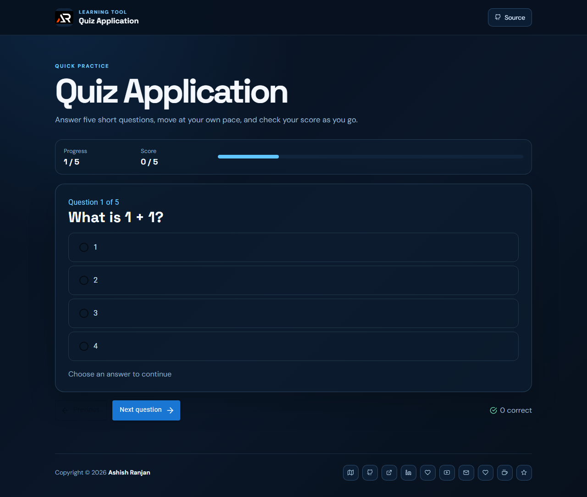

# Quiz Application

A compact React quiz for answering five everyday questions, reviewing feedback, and tracking a live score.

## Features

- Five-question practice flow with previous and next controls.
- Immediate answer feedback and live score.
- Restart option and responsive accessible layout.
- Fixed branded header, icon footer links, and scroll-to-top control.

## Tech stack

React, Create React App, Material UI, Sass, and React Icons.

## Run locally

```bash
npm install
npm start
```

## Deployment

Live app: [https://a2rp.github.io/quiz-application/](https://a2rp.github.io/quiz-application/)

```bash
npm run build
npm run deploy
```



## Links

- Portfolio: [https://www.ashishranjan.net/](https://www.ashishranjan.net/)
- GitHub: [https://github.com/a2rp](https://github.com/a2rp)
- CodePen: [https://codepen.io/ash1198](https://codepen.io/ash1198)
- LinkedIn: [https://www.linkedin.com/in/aashishranjan](https://www.linkedin.com/in/aashishranjan)
- Facebook: [https://www.facebook.com/theash.ashish/](https://www.facebook.com/theash.ashish/)
- YouTube: [https://www.youtube.com/@ashishranjan-ashz?sub_confirmation=1](https://www.youtube.com/@ashishranjan-ashz?sub_confirmation=1)
- Email: [ash.ranjan09@gmail.com](mailto:ash.ranjan09@gmail.com)

## Support

- Support: [https://a2rp-donation-page.netlify.app/](https://a2rp-donation-page.netlify.app/)
- Buy Me a Coffee: [https://buymeacoffee.com/a2rp](https://buymeacoffee.com/a2rp)
- Patreon: [https://patreon.com/a2rp](https://patreon.com/a2rp)
